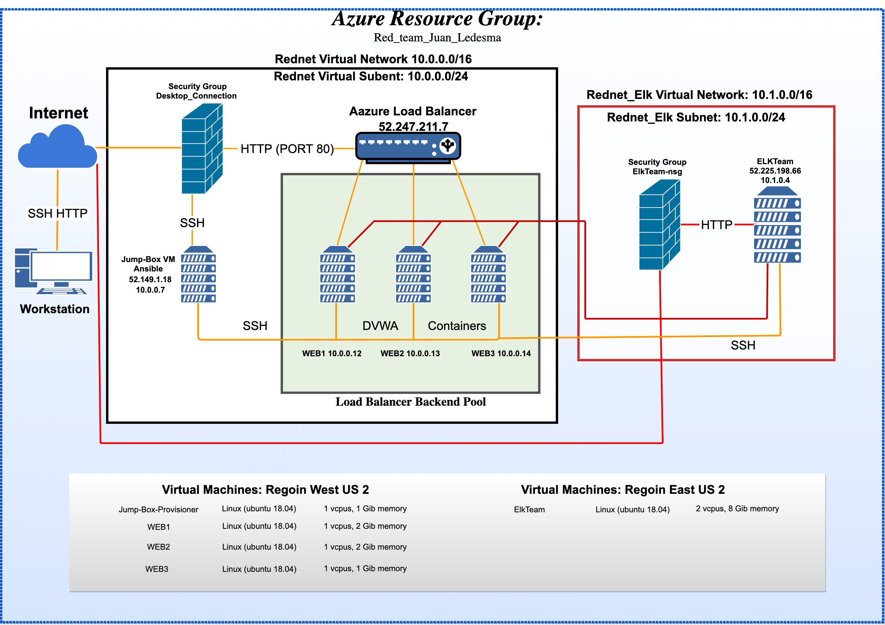
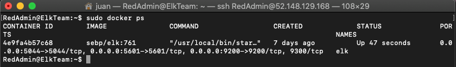

## Automated ELK Stack Deployment

The files in this repository were used to configure the network depicted below.

## Network Diagram Path

These files have been tested and used to generate a live ELK deployment on Azure. They can be used to either recreate the entire deployment pictured above. Alternatively, select portions of the live Elk Deployment file may be used to install only certain pieces of it, such as Filebeat.

/etc/ansible/[elk.yml](https://github.com/Dr-Ledesma/ELK-Stack-Project/blob/master/elk.yml)

This document contains the following details:
- Description of the Topologu
- Access Policies
- ELK Configuration
  - Beats in Use
  - Machines Being Monitored
- How to Use the Ansible Build

### Description of the Topology

The main purpose of this network is to expose a load-balanced and monitored instance of DVWA, the D*mn Vulnerable Web Application.

Load balancing ensures that the application will be highly available, in addition to restricting traffic to the network.
-  What aspect of security do load balancers protect? The Load Balancer helps defends from denial-of-service (DDOs) attack by shifting the server.  
- What is the advantage of a jump box? The advantage of a jump box forces all the traffic through a single node.

Integrating an ELK server allows users to easily monitor the vulnerable VMs for changes to the logs and system traffic.

- What does Filebet watch for? Monitors the log files or locations that you specify, collects log events, and send them to Elasticsearch.

- What does Metricbeat record? Is a lightweight shipper that periodically collects metrics from OS and from services running on the server. It takes the metrics and statistics that it collects and forwards them to Elasticsearch.

The configuration details of each machine may be found below.

| Name     | Function | IP Address | Operating System    |
|----------|----------|------------|---------------------|
| Jump Box | Gateway  | 10.0.0.7   | Linux (Ubuntu 18.04)|
| WEB1     | DVWA     | 10.0.0.12  | Linux (Ubuntu 18.04)|
| WEB2     | DVWA     | 10.0.0.13  | Linux (Ubuntu 18.04)|
| WEB3     | DVWA     | 10.0.0.14  | Linux (Ubuntu 18.04)|
| ElkTeam  | ELK      | 10.1.0.4   | Linux (Ubuntu 18.04)|

### Access Policies

The machines on the internal network are not exposed to the public Internet. 

Only the JumpBox machine can accept connections from the Internet. Access to this machine is only allowed from the following IP addresses: Personal IP Address

Machines within the network can only be accessed by SSH port 22.

- Which machine did you allow to access your ELK VM? Jumpbox from Private IP 10.0.0.7 

A summary of the access policies in place can be found in the table below.

| Name     | Publicly Accessible | Allowed IP Addresses  |
|----------|---------------------|-----------------------|
| Jump Box | No                  | Personal IP           |
| WEB1     | No                  | 10.0.0.7              |
| WEB2     | No                  | 10.0.0.7              |
| WEB3     | No                  | 10.0.0.7              |
| ElkTeam  | No                  | 10.0.0.7 & Personal IP|

### Elk Configuration

Ansible was used to automate configuration of the ELK machine. No configuration was performed manually, which is advantageous because...

- The advantaged is being able to scale automation on multiple machines with a Playbook versus manually configuration.

The playbook implements the following tasks:
- The header of the Playbook can specify a different group of machines as well as a different remote user.
- The playbook should install the following services docker.io, python3-pip, and docker (Docker Python pip module)
- Launching and exposing the container run sebp/elk:761 the container should be started with these published ports.
5601:5601
9200:9200
5044:5044

The following screenshot displays the result of running `docker ps` after successfully configuring the ELK instance.

### Target Machines & Beats
This ELK server is configured to monitor the following machines:
`WEB1 10.0.0.12, WEB2 10.0.0.13, WEB3 10.0.0.14`

We have installed the following Beats on these machines:
- Filebeat and Metricbeat.

These Beats allow us to collect the following information from each machine:
- Filebeat collects data about the file system. It enables analysts to monitor files for suspicious changes.

- Metricbeat collects machine metrics, such as uptime and CPU usage. It makes it easy to collect specific information aboout the machines in the network.

### Using the Playbook
In order to use the playbook, you will need to have an Ansible control node already configured. Assuming you have such a control node provisioned: 

SSH into the control node and follow the steps below:
- Copy the [filebeat-config.yml](https://github.com/Dr-Ledesma/ELK-Stack-Project/new/master) and [metricbeat-config.yml](https://github.com/Dr-Ledesma/ELK-Stack-Project/blob/master/metricbeat-config.yml) file to `/etc/ansible/roles`.
- Update the configuration file to include private IP of the Elkteam server to the ElasticSearch and kibana.
- Run the playbook, and navigate to Elkteam VM to check that the installation worked as expected.

- _Which file is the playbook? [filebeat-playbook.yml](https://github.com/Dr-Ledesma/ELK-Stack-Project/blob/master/filebeat-playbook.yml) Where do you copy it? `curl https://github.com/Dr-Ledesma/ELK-Stack-Project/blob/master/filebeat-playbook.yml > /etc/ansible/roles/filebeat-playbook.yml`
- _Which file do you update to make Ansible run the playbook on a specific machine? You need to update Ansible [Hosts](https://github.com/Dr-Ledesma/ELK-Stack-Project/blob/master/Hosts) within Ansible container `/etc/ansible/hosts` How do I specify which machine to install the ELK server on versus which to install Filebeat on?_
- _Which URL do you navigate to in order to check that the ELK server is running? 
`http://[your.VM.IP]:5601/app/kibana`

